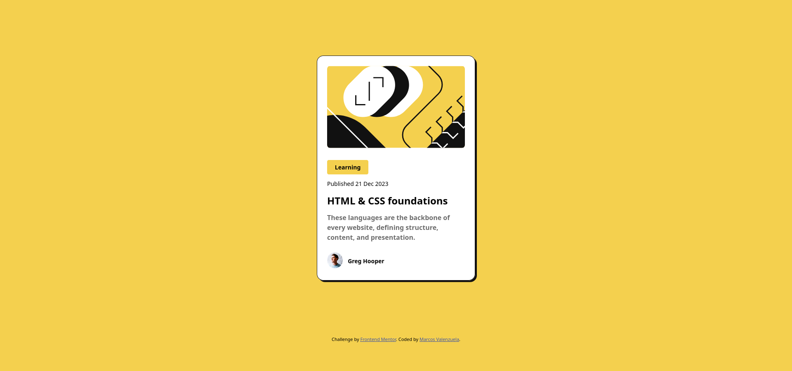
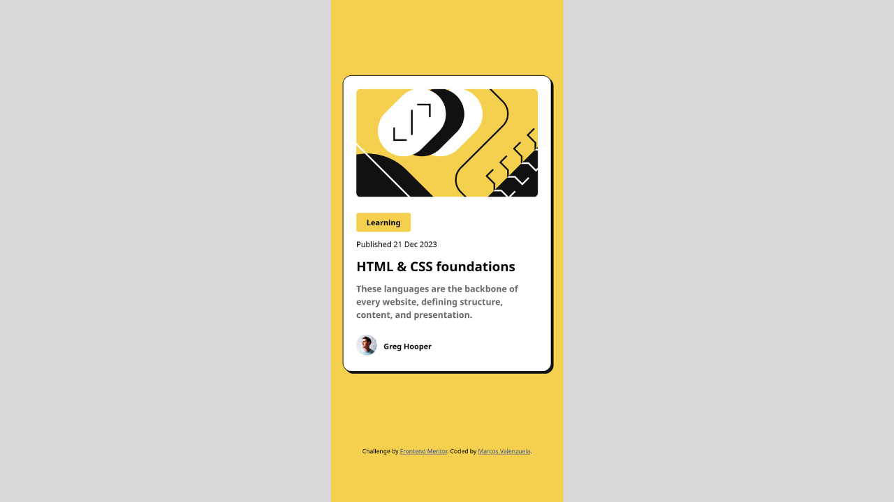

# Frontend Mentor - Blog preview card solution

This is a solution to the [Blog preview card challenge on Frontend Mentor](https://www.frontendmentor.io/challenges/blog-preview-card-ckPaj01IcS). Frontend Mentor challenges help you improve your coding skills by building realistic projects. 

## Table of contents

- [Overview](#overview)
  - [The challenge](#the-challenge)
  - [Screenshot](#screenshot)
  - [Links](#links)
- [My process](#my-process)
  - [Built with](#built-with)
  - [What I learned](#what-i-learned)
  - [Useful resources](#useful-resources)
- [Author](#author)

## Overview

### The challenge

Users should be able to:

- See hover and focus states for all interactive elements on the page

### Screenshot




### Links

- Solution URL: [GitHub](https://github.com/MarcosAvg/blog-preview-card)
- Live Site URL: [blog-preview-card](https://marcosavg.github.io/blog-preview-card/)

## My process

### Built with

- Semantic HTML5 markup
- CSS custom properties
- Flexbox
- Mobile-first workflow

### What I learned

The use of Flexbox and its growth factor and alignment of elements, as well as the different ways it makes a site responsive.

```css
.card__author {
  align-self: flex-start;
  display: flex;
  justify-content: space-between;
  align-items: center;
  gap: 0.75rem;
  max-width: 50%;
}

.card__avatar {
  flex: 1;
}

.card__author-name {
  font-size: 1rem;
  flex: 3;
}
```

### Useful resources

- [CSS-tricks Flexbox](https://css-tricks.com/snippets/css/a-guide-to-flexbox/)
## Author

- GitHub - [MarcosAvg](https://github.com/MarcosAvg)
- Frontend Mentor - [@MarcosAvg](https://www.frontendmentor.io/profile/MarcosAvg)